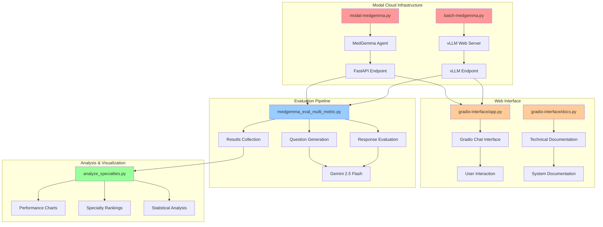

# MedGemma Evaluation Sample

> **Note**: This is a sampler repository that has been hacked together for the **HuggingFace Agents MCP 2025 Hackathon**. It demonstrates a complete pipeline for evaluating the MedGemma multimodal medical AI model across different medical specialties.

## Overview

This repository contains a comprehensive evaluation framework for MedGemma, a multimodal medical AI model. The system evaluates MedGemma's performance across 35 medical specialties using multiple metrics including medical accuracy, safety, and jargon-free communication.

## Architecture



## Components

### 1. Modal Deployment Scripts

#### `modal-medgemma.py`
**Purpose**: Deploys MedGemma as a FastAPI endpoint on Modal with tool-calling capabilities.

**Key Features**:
- MedGemma model loading with GPU support
- FastAPI streaming endpoint
- Wikipedia tool integration
- Base64 image processing
- API key authentication

**Deployment**:
```bash
modal deploy modal-medgemma.py
```

**Usage**: Provides a streaming API endpoint for real-time MedGemma inference with multimodal capabilities.

#### `batch-medgemma.py`
**Purpose**: Deploys MedGemma using vLLM for high-throughput batch processing.

**Key Features**:
- vLLM-based model serving
- Web server endpoint
- Optimized for batch inference
- GPU memory optimization

**Deployment**:
```bash
modal deploy batch-medgemma.py
```

**Usage**: Provides a vLLM-compatible endpoint for batch processing of medical queries.

### 2. Gradio Web Interface

#### `gradio-interface/app.py`
**Purpose**: Provides a user-friendly web interface for interacting with MedGemma.

**Usage**:
```bash
cd gradio-interface
python app.py
# or deploy to huggingface spaces
```

**Environment Variables**:
```bash
export API_KEY="your-api-key"
export MODAL_API_ENDPOINT="your-modal-endpoint-url"
```

### 3. Evaluation Framework

#### `medgemma_eval_multi_metric.py`
**Purpose**: Comprehensive evaluation script that tests MedGemma across 35 medical specialties.

**Key Features**:
- Generates 20 questions per specialty (700 total questions)
- Uses Gemini 2.5 Flash as judge for evaluation
- Multi-metric evaluation (accuracy, safety, jargon-free)
- Batch processing capabilities
- Results export to JSON/CSV

**Metrics Evaluated**:
- **Medical Accuracy**: Factual correctness of medical information
- **Medical Safety**: Safety of medical advice provided
- **Jargon-Free Communication**: Clarity for layperson understanding

**Usage**:
```bash
# Set environment variables
export MODAL_ENDPOINT_URL="your-modal-endpoint"
export MODAL_API_KEY="your-modal-api-key"
export GOOGLE_API_KEY="your-google-api-key"

# Run evaluation
python medgemma_eval_multi_metric.py
```

### 4. Analysis & Visualization

#### `analyze_specialties.py`
**Purpose**: Analyzes evaluation results and generates comprehensive visualizations.

**Key Features**:
- Performance comparison across specialties
- Statistical analysis and rankings
- Multiple visualization types:
  - Bar charts comparing all metrics
  - Heatmaps for specialty performance
  - Radar charts for top specialties
  - Scatter plots of performance vs question count

**Generated Outputs**:
- `specialty_comparison_bars.png`
- `specialty_heatmap.png`
- `top_specialties_radar.png`
- `performance_vs_questions.png`

**Usage**:
```bash
python analyze_specialties.py
```

## Deployment Instructions

### Prerequisites

1. **Modal Account**: Sign up at [modal.com](https://modal.com)
2. **HuggingFace Token**: For accessing MedGemma model
3. **Google API Key**: For Gemini 2.5 Flash evaluation
4. **Python Environment**: Python 3.8+ with required packages

### Environment Setup

Create a `.env` file with:
```env
MODAL_ENDPOINT_URL=https://your-username--example-medgemma-agent-run-medgemma.modal.run
MODAL_API_KEY=your-modal-api-key
GOOGLE_API_KEY=your-google-api-key
API_KEY=your-api-key-for-gradio-interface
```

### Modal Secrets Setup

Set up required Modal secrets:
```bash
# HuggingFace access token
modal secret create access_medgemma_hf HF_TOKEN=your-hf-token

# FastAPI key for endpoint security
modal secret create FASTAPI_KEY FASTAPI_KEY=your-fastapi-key

# Modal API key for vLLM endpoint
modal secret create MODAL_API_KEY MODAL_API_KEY=your-modal-api-key
```

### Deployment Steps

1. **Deploy Modal Endpoints**:
   ```bash
   # Deploy FastAPI endpoint
   modal deploy modal-medgemma.py
   
   # Deploy vLLM endpoint
   modal deploy batch-medgemma.py
   ```

2. **Launch Gradio Interface** (Optional):
   ```bash
   cd gradio-interface
   python app.py
   ```

3. **Run Evaluation**:
   ```bash
   python medgemma_eval_multi_metric.py
   ```

4. **Analyze Results**:
   ```bash
   python analyze_specialties.py
   ```

## Medical Specialties Evaluated

The system evaluates MedGemma across 35 medical specialties:
- Orthopaedics, Gynaecology, Paediatrics, Cardiology
- Neurology, Dermatology, Oncology, Gastroenterology
- Pulmonology, Endocrinology, Nephrology, Rheumatology
- Ophthalmology, Urology, Psychiatry, Anesthesiology
- Emergency Medicine, Family Medicine, Internal Medicine
- Obstetrics, Otolaryngology, Pathology, Occupational Medicine
- Plastic Surgery, Radiology, General Surgery, Vascular Surgery
- Immunology, Infectious Disease, Hematology, Genetics
- Disaster Medicine, General Practice, Nutrition, Physiotherapy

## Results Interpretation

The evaluation provides insights into:
- **Specialty Performance**: Which medical specialties MedGemma handles best
- **Metric Analysis**: How well MedGemma performs on accuracy vs safety vs communication
- **Question Volume Impact**: Whether performance correlates with question count
- **Overall Model Capabilities**: Comprehensive assessment of MedGemma's medical AI capabilities

## Contributing

This is a hackathon project demonstrating evaluation methodologies for medical AI models. Feel free to adapt and extend the evaluation framework for other medical AI models or additional metrics.

## License

This project is part of the HuggingFace Agents MCP 2025 Hackathon and is provided as-is for educational and research purposes.
